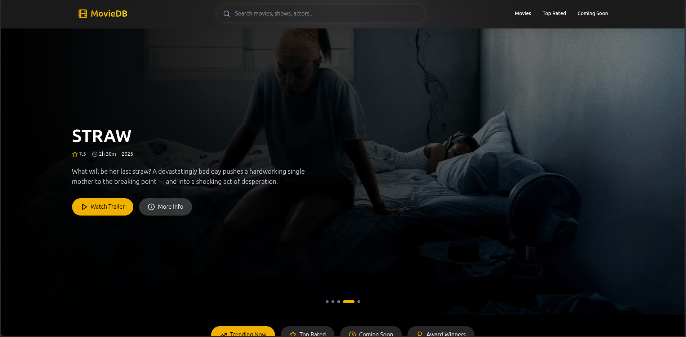

# Movie Explorer

A modern, responsive web application for exploring and discovering movies. Built with React and designed with a sleek, user-friendly interface.



## Features

- **Discover Movies**: Browse through a curated collection of movies
- **Movie Details**: View comprehensive information about each movie
- **Responsive Design**: Enjoy a seamless experience across all devices
- **Smooth Animations**: Enhanced user experience with Framer Motion animations
- **Performance Optimized**: Implements lazy loading and image preloading
- **Search Functionality**: Find your favorite movies with ease

## Technologies Used

- **React**: Frontend library for building the user interface
- **React Router**: For handling navigation and routing
- **Framer Motion**: For smooth animations and transitions
- **Tailwind CSS**: For styling and responsive design
- **TMDB API**: For fetching movie data

## Getting Started

### Prerequisites

- Node.js (v14.0.0 or later)
- npm or yarn

### Installation

1. Clone the repository:
   ```bash
   git clone https://github.com/yourusername/movie-explorer.git
   cd movie-explorer
   ```

2. Install dependencies:
   ```bash
   npm install
   # or
   yarn install
   ```

3. Create a `.env` file in the root directory and add your TMDB API key:
   ```
   VITE_TMDB_API_KEY=your_api_key_here
   ```

4. Start the development server:
   ```bash
   npm run dev
   # or
   yarn dev
   ```

5. Open your browser and navigate to `http://localhost:5173`

## Deployment

This project is configured for easy deployment to Vercel. The `vercel.json` file handles routing for the SPA.

To deploy to Vercel:

1. Push your code to a GitHub repository
2. Import the project in Vercel
3. Set the environment variables
4. Deploy

## Project Structure

```
/
├── components/        # React components
├── hooks/             # Custom React hooks
├── public/            # Static assets
├── services/          # API service functions
├── src/               # Main source code
├── utilities/         # Utility functions
├── .env               # Environment variables
└── vercel.json        # Vercel configuration
```

## Performance Optimizations

- **Lazy Loading**: Images load only when they enter the viewport
- **Image Preloading**: Improves perceived performance
- **Code Splitting**: Reduces initial load time
- **Optimized Animations**: Smooth experience without performance hit

## Contributing

Contributions are welcome! Please feel free to submit a Pull Request.

1. Fork the repository
2. Create your feature branch (`git checkout -b feature/amazing-feature`)
3. Commit your changes (`git commit -m 'Add some amazing feature'`)
4. Push to the branch (`git push origin feature/amazing-feature`)
5. Open a Pull Request

## License

This project is licensed under the MIT License - see the LICENSE file for details.

## Acknowledgments

- [TMDB](https://www.themoviedb.org/) for providing the movie data API
- [Framer Motion](https://www.framer.com/motion/) for the animation library
- [Tailwind CSS](https://tailwindcss.com/) for the utility-first CSS framework
- [Lucide Icons](https://lucide.dev/) for the beautiful icons
